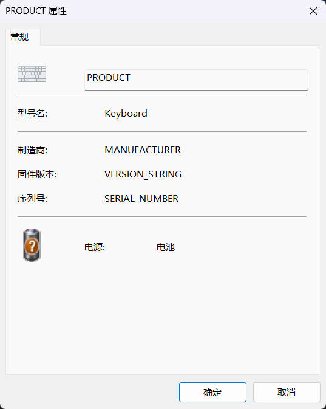
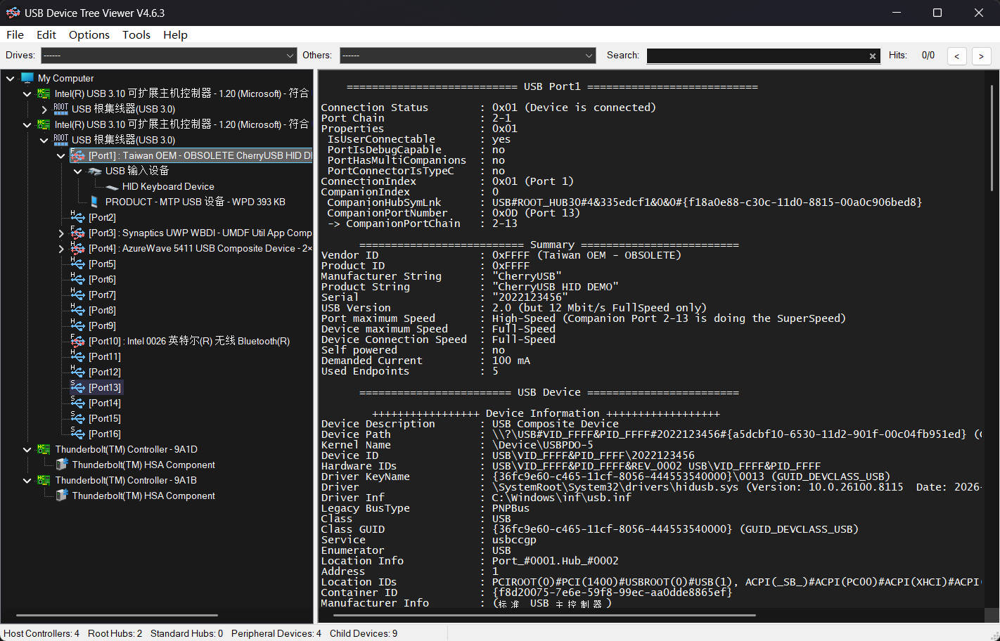

# STM32F411CE 基于 CherryUSB 的 MTP 协议栈移植与实现

本文档详细阐述了一个基于 STM32F411CE 微控制器的 USB 媒体传输协议（MTP, Media Transfer Protocol）演示项目的工程架构与操作指南。本项目的核心工作在于将 TinyUSB 协议栈中成熟的 MTP 类驱动模块剥离，并成功移植与适配至 CherryUSB 设备协议栈，从而在不同的协议框架间实现了核心组件的有效复用。

## 📸 项目演示 (Project Demonstration)





## 🌟 系统特性

* **底层协议框架**：系统底层依托轻量级且具备高性能特性的 [CherryUSB](https://github.com/cherry-usb/CherryUSB) 设备栈构建。

* **MTP 驱动实现**：应用层 MTP 逻辑提取自开源的 [TinyUSB](https://github.com/hathach/tinyusb) 协议栈（位于 `mtp/` 目录），并针对目标框架完成了深度适配与封装。

* **硬件承载平台**：系统运行于以 STM32F411CEU6 为核心的评估板（通常称为 "Black Pill"）。

* **构建系统**：工程支持 CMake 跨平台构建体系与 Keil MDK 集成开发环境，显著提升了项目的平台兼容性与开发灵活性。

## 📂 项目文件组织结构

```text
├── CMakeLists.txt        # CMake 主构建脚本
├── Core/                 # STM32CubeMX 生成的核心底层代码
├── Drivers/              # STM32 HAL 库及 CMSIS 核心头文件
├── mtp/                  # 核心移植层：TinyUSB MTP 类驱动及底层适配接口
│   ├── tusb_config.h     # MTP 功能配置，包含设备描述字符串定义
│   ├── mtp_fs_port.c     # MTP 文件系统对接层
│   ├── mtp_fs_conv.c     # MTP 驱动与文件系统转换层
│   ├── mtp_device.c      # TinyUSB MTP 设备驱动层
│   └── usbd_mtp.c        # CherryUSB 与 TinyUSB MTP 驱动转接层
├── usb/                  # CherryUSB 协议栈应用层配置
│   └── usbd_user.c       # 设备栈配置层 (涵盖描述符定义及类接口挂载)
└── tinyusb-mtp-for-cherryusb-demo-f411ce.ioc # STM32CubeMX 工程文件
````

## 🛠️ 系统运行环境要求

  * **微控制器平台**：STM32F411CEU6 核心板。

  * **调试与烧录接口**：支持 SWD 标准调试器或通过 Type-C 线缆进行 DFU 烧录。

  * **数据链路**：标准 Type-C 线缆。

## 💻 软件依赖与编译部署规范

本工程支持双轨制构建体系，开发者可根据宿主机环境偏好，灵活选择基于 Keil MDK 的传统集成开发环境（IDE）或基于 CMake 的现代化跨平台构建流程。在进行任意一种编译前，请务必完整克隆本仓库及关联的子模块：

```bash
git clone https://github.com/zhangqili/tinyusb-mtp-for-cherryusb-demo-f411ce.git --recursive 
```

### 方案一：基于 Keil MDK 的集成编译方案（推荐 Windows 环境）

1.  **环境依赖配置**：确保宿主机已安装 Keil MDK-ARM（建议使用 V5.30 或更高版本），并已通过 Pack Installer 安装针对 STM32F4 系列的器件支持包（Device Family Pack）。

2.  **工程载入与编译**：

      * 导航至 `MDK-ARM/` 目录下，定位并双击打开对应的 Keil 工程文件。

      * 经由 IDE 菜单栏执行 `Project -> Build Target`（或利用快捷键 `F7`）启动编译序列。

      * 编译进程结束后，目标固件将输出至 `MDK-ARM/tinyusb-mtp-for-cherryusb-demo-f411ce` 目录中。

### 方案二：基于 CMake 体系的命令行编译方案（推荐跨平台环境）

1.  **环境依赖配置**：需在系统中部署 CMake (\>= 3.16)、`arm-none-eabi-gcc` 交叉编译工具链、 Ninja 构建系统。

2.  **固件编译操作**：
    在项目根路径下执行以下指令以完成外部构建（Out-of-source build）：

    ```bash
    mkdir build && cd build
    cmake .. --preset=Release
    cd Release
    ninja
    ```

## 🚀 固件烧录与系统验证

### 1\. 固件部署

  * **方式一：SWD 部署**：通过 ST-Link 等工具将编译输出的 `.bin` 或 `.hex` 文件写入闪存。

  * **方式二：USB DFU 部署**：按住目标板的 `BOOT0` 键并重启，使微控制器进入 DFU 引导模式，随后利用 STM32CubeProgrammer 完成固件烧录。

### 2\. 关键操作指南

  * **格式化介质**：上电时**持续按住 KEY 键**，触发存储介质初始化。

  * **MTP 功能**：在资源管理器中访问 "PRODUCT" 进行文件操作。

  * **HID 功能**：运行状态下**短按 KEY 键**，系统模拟键盘发送字符 **'A'**。

## 📝 技术规范与移植说明

本项目解决了 USB 大容量存储类（MSC）在主机访问期间的块设备独占痛点。媒体传输协议（MTP）基于文件级传输逻辑，允许主机与 MCU 同时安全地操作文件系统。

在移植过程中，我们将 `mtp/mtp_device.c` 核心状态机成功桥接至 CherryUSB 的端点数据收发接口，实现了协议处理与底层硬件的解耦。如需更换存储介质（如 SPI Flash 或 SD 卡），请主要修改 `mtp/mtp_fs_port.c` 接口层。

## 🤝 致谢

  * [CherryUSB](https://www.google.com/url?sa=E&source=gmail&q=https://github.com/cherry-usb/CherryUSB)

  * [TinyUSB](https://github.com/hathach/tinyusb)

## 📄 许可协议

  * HAL 库：STMicroelectronics SLA0044。

  * MTP 移植代码：遵循 TinyUSB 项目的 MIT 许可协议。
